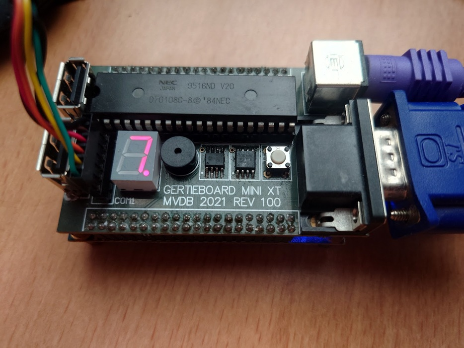

# Gertieboard

An IBM PC/XT-class computer built around a **real, physical CPU**, with the entire
rest of the chipset implemented in an FPGA.



Two stacked boards. The **Gertieboard Mini XT** top board carries everything that
had to be physical; a stock **Terasic DE0-Nano** underneath carries the FPGA.

```
   +----------------------------------------------------------+
   |  GERTIEBOARD MINI XT  -  MVDB 2021 REV 100                |
   |                                                            |
   |    NEC V20 CPU  .  PSRAM  .  SPI FLASH (2 MB)             |
   |    VGA  .  PS/2 keyboard  .  2x USB  .  FTDI 3V3 serial   |
   |    7-segment POST display  .  buzzer  .  reset button     |
   +----------------------------------------------------------+
                  |  2x 40-pin GPIO
   +----------------------------------------------------------+
   |  Terasic DE0-Nano  (Cyclone IV EP4CE22F17C6)              |
   |                                                            |
   |    the chipset: bus decode, memory controller, CGA,        |
   |    8259 PIC, 8253 PIT, 8255 PPI, 8237 DMA, 8272 FDC,       |
   |    keyboard controller, boot ROM                           |
   |                                                            |
   |    also on it, unused: 32 MB SDRAM, accelerometer, ADC     |
   +----------------------------------------------------------+
```

The CPU could have been a soft core in the FPGA, but putting a genuine processor
on the board was the point of the exercise: the FPGA plays the role the
surrounding chipset played in 1983, and nothing more.

Full inventory of both boards: **[docs/hardware.md](docs/hardware.md)**.

## What it does today

- Boots **IBM PC-DOS 3.3**
- **CGA** 80×25 colour text plus graphics modes 4, 5 and 6, output as 640×480 VGA
- **PS/2 keyboard**, including a hardware Ctrl+Alt+Del that no software can bypass
- **Floppy** served over serial from a host loader
- **Fixed disk** (2 MB) backed by the on-board SPI flash — FDISK and FORMAT work
- PC speaker, 8253 timer, 8259 interrupt controller, 8237 DMA, 8255 PPI
- 640 KB RAM, and the FPGA configures itself from its own flash at power-on
- Runs real software: Alley Cat, Digger, Sopwith, PC-DOS utilities

### On the list

| | Planned |
|---|---|
| **USB keyboard** | Both USB ports go straight to FPGA pins, so this means a soft low-speed host — the scancode translation already exists |
| **AdLib / Sound Blaster** | The DMA controller and PIC are already there and proven; an OPL2 at `0x388` is the self-contained first step |
| **EGA** | Wants 256 KB of planar video memory, which is four times the on-chip RAM this device has — so it has to be PSRAM-backed |
| **USB mass storage** | The hardest of the four, and the one the SPI-flash disk already partly covers |

One thing is **known broken**: the BIOS copy in flash verifies byte-for-byte but does
not boot, so a host is still needed at power-on.

Full detail, including why each item is hard and what it needs, is in
**[Status and roadmap](docs/status.md)**.

## Documentation

Start at **[docs/README.md](docs/README.md)**.

| Page | Contents |
|---|---|
| [Hardware](docs/hardware.md) | The two boards: what is on each, and what is deliberately unused |
| [Architecture](docs/architecture.md) | System overview, clock tree, reset, bus cycles, DMA, interrupts |
| [Memory map](docs/memory-map.md) | Memory regions and the complete I/O port map |
| [Modules](docs/modules/README.md) | Every FPGA module: entity ports, addresses, behaviour |
| [Pinout](docs/pinout.md) | FPGA pin assignments |
| [Boot flow](docs/boot.md) | Reset, boot ROM overlay, serial and flash BIOS paths |
| [BIOS](docs/bios.md) | Interrupt services, BIOS data area, build |
| [Fixed disk](docs/fixed-disk.md) | The SPI-flash hard disk |
| [Building](docs/building.md) | Toolchain, scripts, programming the board |
| [Tools](docs/tools.md) | DOS diagnostics and host-side utilities |
| [Status and roadmap](docs/status.md) | What works, what does not, and what is planned |
| [Gotchas](docs/gotchas.md) | Hard-won lessons — **read before writing 8088 code** |

## The host loader

The board has no floppy drive, so a host program serves the floppy image — and, during
development, the BIOS as well — over a serial link.

**[GertieBoardLoader](https://github.com/mathijsvandenberg/gertieboardloader)** is that
program. It watches both files and reloads them automatically, so rebuilding a BIOS is a
rebuild-and-reboot away with nothing to restart. The
[protocol](docs/tools.md#protocol) is four bytes and a payload if you would rather write
your own.

## Repository layout

```
*.vhd, *.vhdl        FPGA sources (gertieboard.vhdl is the top level)
gertieboard.qsf      Quartus project: pin assignments, source list
gertieboard.sdc      Timing constraints
tools/               BIOS source, DOS utilities, build and host scripts
docs/                This documentation
```

## A short history

The idea was a board you could **build yourself**. Nearly everything on it is
through-hole — the CPU in a socket, the connectors, the display, the buzzer, the
headers — so it is a kit an enthusiast can assemble with an ordinary iron. Only
the PSRAM and the SPI FLASH are surface-mount, two SOIC-8 parts. Using an
off-the-shelf DE0-Nano for the FPGA is part of the same decision: nobody has to
solder a fine-pitch device to own one of these.

My father soldered one.

The top board was designed and built in **2021** — the silkscreen still reads
`MVDB 2021 REV 100`. Then it stalled. Not for lack of interest, but because three
problems refused to give way: **memory corruption**, **timing closure**, and
**negative slack** that would not go away no matter how the design was pushed
around. A machine that boots differently every time is not a machine you can
debug your way forward on, and eventually the motivation ran out. The board went
in a drawer for the better part of four years.

What got it out again was my father turning **67 and retiring**. That is the
deadline this picked up in mid-2026, and the reason the BIOS banner reads
**"Gertieboard BIOS Retirement Edition"**: I wanted the board he had soldered to
actually work, and to hand it to him now that he finally has the time for it.

The boot screen is a deliberate callback to the same period. It is styled after
the **Philips P2120** BIOS — the first PC we had at home, paired with a Philips
**7BM723** monochrome monitor. Same layout, same wording, same spacing, down to
`Parity Checking Enabled` on a machine that has no parity to check.

This time Claude went at it with me. The three original blockers went first —
which turned out to be the whole problem, because everything after them had only
ever been waiting on a stable machine. From there it went quickly: CGA, then the
keyboard, then DMA and the floppy link, then DOS, then a hard disk on the SPI
flash. The board runs real software now.

The [gotchas](docs/gotchas.md) page is the honest record of that second stretch.
Several of the entries cost days, and one of them — an assembler quietly emitting
a 386 instruction that is not a branch at all on this CPU — cost considerably
more than that.

## About the name

Gertieboard is named after my father, **Geert**, known to everyone as
**Gertie** — like me, an enthusiast for retro computing.

> _Personal note to be expanded by the author._

## Contributing

Contributions are welcome — see **[CONTRIBUTING.md](CONTRIBUTING.md)**. By opening a
pull request you agree that your contribution is licensed under the MIT Licence, the
same as everything else here. No CLA, no paperwork.

If you are looking for somewhere to start, [docs/status.md](docs/status.md) lists what
is planned and what the actual obstacle is for each item. Read
[docs/gotchas.md](docs/gotchas.md) first regardless — it is short and it will save you
days.

## Licence

[MIT](LICENSE) — do what you like with it, keep the copyright notice, and it comes with
**no warranty of any kind**. This is a hobby computer built from a real CPU, an FPGA and
a soldering iron; if you build one, you build it at your own risk, and nothing here is
fit for any purpose beyond having fun with it.

### Third-party content

The licence covers the work in this repository. A few things in or around the project
are **not** mine to license, and are handled as follows:

| | |
|---|---|
| **Disk images, DOS, games** | Not in the repository — `*.img` and `*.IMA` are gitignored. Bring your own. |
| **Reference BIOS disassembly** | `tools/philips.asm` is a disassembly of a commercial BIOS kept locally for comparison. Gitignored, never committed, and no code from it is in this BIOS. |
| **`tools/font8x8.bin`** | An 8×8 character font, squashed down from the FPGA's 8×16 text font. Bitmap fonts of this kind are generally not copyrightable, but the provenance is not documented — treat it as replaceable if that matters to you. |
| **Tool executables** | `nasm.exe`, `ndisasm.exe` and similar are gitignored. Install your own. |
| **The boot screen** | Deliberately styled after a Philips P2120 and it says so. The BIOS underneath is written from scratch. |

**Schematics are coming.** They are not in the repository yet. MIT is a software
licence and does not map cleanly onto a PCB, so when they land the natural pairing is
[CERN-OHL-P](https://cern-ohl.web.cern.ch/) — the permissive hardware licence in the
same spirit as MIT, written for exactly this.
