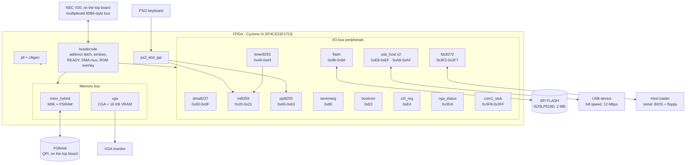

# Architecture

## Overview

A real CPU — an NEC **V20** (µPD70108C-8) on the [top board](hardware.md) — drives a
multiplexed 8088-style bus. Everything else — bus decode, memory control, video,
interrupts, timers, DMA, floppy, keyboard — lives in the FPGA as separate VHDL
modules hanging off two internal buses.

The top level is [`gertieboard.vhdl`](../gertieboard.vhdl): a purely structural
netlist that instantiates the modules and wires them together. It contains no
logic of its own beyond tie-offs and the speaker AND gate.



## Clocks

One PLL (`pll1`) divides the DE0-Nano's 50 MHz oscillator; a second
([`pll48`](modules/clkgen-pll.md#pll48--48-mhz-for-usb)) makes 48 MHz for the USB
host. Two of the device's four PLLs are used.

| Output | Divider | Frequency | Drives |
|---|---|---|---|
| `c0` | ×2 | **100 MHz** | `cpuclk` only — the master the bus clock is divided from |
| `c1` | ÷2 | **25 MHz** | `vga.CLK_VGA` — VGA pixel clock |
| `c2` | ÷42 | **1.1905 MHz** | `timer8253`'s *counting* rate (its registers run on the bus clock) — within 0.23 % of the XT's 1.193182 MHz |
| `c3` | ÷1 | **50 MHz** | `mem_hybrid` (PSRAM), `sdram_ctrl`, `ps2_kbd_ppi` |
| `c4` | — | unused | |

**The bus clock is not a PLL output.** [`cpuclk`](modules/clkgen-pll.md#cpuclk--the-programmable-bus-clock)
divides `c0` by a high count plus a low count chosen at run time through I/O **0xE5**, giving a
ladder from 5 to 16.667 MHz, and it is what drives `CPU_CLK` (the real CPU) and the
entire I/O bus: `busdecode`, `ppi8255`, `sevenseg`, `ctrl_reg`, `int8259`, `dma8237`,
`fdc8272`, `flash`, `bootrom`, `crtc6845`, `opl2_lite`, `usb_host` and `vga.CLK_CPU`.
It resets to 8.333 MHz, which is what the machine ran at before the ladder existed.

The high and low counts are set independently so that **both** edges land on `c3`'s
20 ns grid at every step. Equal halves would put the falling edge off that grid on the
odd steps, and on hardware every odd step then died — including 7.143 MHz, which is
*slower* than a step that works. The duty cycle falls out of the grid rather than being
chosen: 33 % at 16.667 MHz, which is what an 8284 gives a 16 MHz part.

`pll48` is separate because 48 MHz is 50 × 24/25 and therefore **not** integer-related
to the others. All of `pll1`'s outputs use `multiply_by => 1`, so adding a 24/25 output
would force a new VCO for the whole block and all four working domains would have to be
re-derived from it. It is also its own asynchronous clock group in the SDC — omitting
that put −2.483 ns of setup slack on `c0`.

> **Reading the PLL settings:** in `altpll`, `inclk0_input_frequency` is the input
> **period in picoseconds** — `20000` means 20 ns, i.e. 50 MHz. Misreading it as
> kHz once led to a confident but completely wrong conclusion that the 8253 was
> running at 476 kHz. See [gotchas](gotchas.md).

### What has to be re-tuned when the clock moves

Anything counted in bus clocks but owed in seconds breaks when the bus clock moves,
and it breaks *silently* — nothing reports a mistuned divider, it just misbehaves.
Since the clock now moves at run time, those dividers cannot be constants folded out
of a generic any more. `cpuclk` holds a table indexed by the step and drives them:

| Consumer | Input | What it sets | If it were left fixed |
|---|---|---|---|
| `opl2_lite` | `SAMPLE_DIV` | the 49716 Hz sample clock | music transposed by the speed ratio |
| `opl2_lite` | `T1_DIV`, `T2_DIV` | the 80 µs / 320 µs detection timers | the AdLib fails its detection handshake, and a game decides there is no card |

[`fdc8272`](modules/fdc8272.md) took the same treatment and then went one better.
Re-deriving `BAUD_DIV` per step kept the link alive, but an integer divide of 5 / 6.25 /
7.143 / 8.333 / 10 / 12.5 / 16.667 MHz never lands on the same number twice, and the best
available was **+4.2 % at the step the machine boots at** — inside 8N1's ~5 % envelope,
but not clear of it. It also did not scale: at 2 Mbaud a 6.25 MHz bus clock needs a
divisor of 3.125 and gets 3, which is 25 % out.

So its UART is not clocked by the CPU at all any more. It runs on `c3`, where
`50e6 / 50` = **1,000,000 baud exactly**, at every step, forever — with a toggle
handshake across to the command engine, which still runs on the bus clock. `BAUD =>
2_000_000` (divisor 25, also exact) is a one-line change on both ends.

The generics survive only as the values those inputs take when nothing drives them,
which is what keeps each module usable on its own:

```vhdl
fdc1      : fdc8272     GENERIC MAP (UART_CLK_HZ => 50000000, BAUD => 1000000)
inst3     : ps2_kbd_ppi GENERIC MAP (CLK_FREQ_HZ => 50000000)
opl2lite1 : opl2_lite   GENERIC MAP (CLK_HZ      => 8_333_333)
```

`ps2_kbd_ppi` is the exception and needs nothing: it runs on `c3`, which does not
move. Its generic still matters — with the entity default of 5 MHz the PS/2 glitch
filter, frame watchdog and keyboard-hold timeout are all 10× too short.

Three things do **not** follow the bus clock, and that is deliberate:

- **The host serial link**, now that `fdc8272`'s UART is on `c3` — see above.

- **The 18.2 Hz BIOS tick**, which comes from `c2`. It is an honest time reference
  across speed changes, which is what makes measuring the speed possible at all
  (`tools/speed.asm`).
- **`busdecode`'s READY backstop**, which counts CPU clocks and so shortens in real
  time as the clock rises. It is sized for the fastest step: 256 clocks is 15.4 µs at
  16.667 MHz against a worst legitimate access of ~4.9 µs.

## Reset

```
RESET pin (active LOW, PIN_A8) ──┐
                                 ├──> clkgen ──> RST_OUT (active HIGH) ──> all modules
ps2_kbd_ppi.cad_rst ─────────────┘     (hardware Ctrl+Alt+Del, ~1 ms pulse)
```

In the top level:

```vhdl
n_reset <= RESET AND NOT n_cad_rst;
```

`clkgen` is trivial: while its active-low input is asserted it holds `RST_OUT`
high, then keeps it high for another 10 CPU clocks before releasing.

A genuine reset matters, because several things key off it:

- `bootrom` re-arms its overlay (`ROM_EN` back to `'1'`), so the BIOS is fetched
  again from scratch
- `vga` returns to 80×25 text when the BIOS re-runs `vid_init`
- `ctrl_reg` reloads its safe PSRAM timing default
- `psram_ctrl` re-runs its QPI initialisation sequence

## Bus cycles and READY

`busdecode` latches the address on `ALE`, generates the four active-low strobes
(`IO_RD`, `IO_WR`, `MEM_RD`, `MEM_WR`) and drives `CPU_RDY`:

```
READY = '1' when  T >= 64 and memory cycle          <-- fault backstop only
        or        memory cycle and RAM_READY = '1'
        or        T >= 3 and (I/O cycle or not a memory address)
```

`T` counts CPU clocks since `ALE`.

> The `T >= 64` clause is a **backstop against a wedged memory controller, not a
> timing parameter**. It must always be longer than the slowest legitimate access.
> It was originally `T >= 10`, which aborted every PSRAM cache-line fill and
> released the CPU before the data bus was driven — silent corruption. Do not
> shorten it.

`MEMADDR` (what counts as a memory address) is `ADDR < 0xA0000` or
`ADDR >= 0xE0000`.

## Internal buses

| Signal | Width | Purpose |
|---|---|---|
| `n_cpu_wdata` | 8 | CPU → peripherals write data, from `busdecode.DATA_OUT` |
| `n_periph_rdata` | 8 | peripherals → CPU read data — **tri-state, shared** |
| `n_io_addr` | 16 | latched I/O address |
| `n_mem_addr` | 20 | latched memory address (or DMA address during `HLDA`) |

Every peripheral that drives `n_periph_rdata` must return `"ZZZZZZZZ"` unless it
is *both* addressed *and* being read:

```vhdl
DATAOUT <= my_reg WHEN (RD = '0' AND ADDR = x"0099") ELSE "ZZZZZZZZ";
```

Omitting the `RD` qualifier — as the original `flash.vhd` did — puts two drivers
on the bus during write cycles.

## DMA

Only channel 2 is used, by the floppy controller:

```
fdc8272.DRQ ─> dma8237.DREQ ─> HRQ ─> CPU HOLD
CPU HLDA ─> dma8237 drives DMA_ADDR, DACK and the memory strobe for one byte,
            waits for RAM_READY, advances, decrements, releases HRQ
```

Data does **not** pass through `dma8237`. The byte moves between the FDC and PSRAM
through `busdecode`'s `HLDA` mux; the DMA engine only sequences the transfer. The
upper four address bits come from a page register at I/O `0x81`, implemented inside
`busdecode` (the XT's separate 74LS612).

## Interrupts

| Level | Source | Purpose |
|---|---|---|
| IRQ0 | `timer8253.OUT0` | 18.2 Hz system tick → `INT 08h` |
| IRQ1 | `ps2_kbd_ppi.irq1` | keyboard scancode ready → `INT 09h` |
| IRQ2 | tied `'0'` | unused |
| IRQ6 | `fdc8272.IRQ` | floppy → `INT 0Eh` |

`int8259.INT` drives `CPU_INTR`; `CPU_INTA` feeds back the two-pulse
interrupt-acknowledge cycle.

## Deliberate quirks

These look like bugs but are intentional:

- `DBG(7..2)` are tied low; `DBG(0)`/`DBG(1)` are debug taps of `PS2CLK`/`PS2DAT`
- `ppi8255`'s `ENABLE_PARITY_N`, `ENABLE_IOCHK_N` and `KBD_CLOCK_HOLD` outputs are
  `OPEN` — genuine XT features not implemented
- `SPEAKER_MUTE` is a constant in the top level for silencing the buzzer during
  late-night work

Two former quirks are gone: `USB0_DP`/`USB0_DM` are now driven by
[`usb_host`](modules/usb_host.md), and the dead second PLL was replaced by the
48 MHz `pll48` that feeds it.

## Related

- [Hardware](hardware.md) — the physical side of this diagram
- [Memory map](memory-map.md)
- [Modules](modules/README.md)
- [Boot flow](boot.md)
- [Gotchas](gotchas.md)
