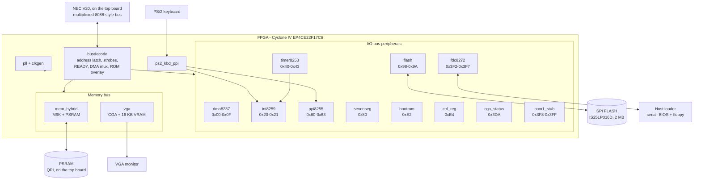

# Architecture

## Overview

A real CPU — an NEC **V20** (µPD70108C-8) on the [top board](hardware.md) — drives a
multiplexed 8088-style bus. Everything else — bus decode, memory control, video,
interrupts, timers, DMA, floppy, keyboard — lives in the FPGA as separate VHDL
modules hanging off two internal buses.

The top level is [`gertieboard.vhdl`](../gertieboard.vhdl): a purely structural
netlist that instantiates the modules and wires them together. It contains no
logic of its own beyond tie-offs and the speaker AND gate.



## Clocks

One PLL (`pll1`) divides the DE0-Nano's 50 MHz oscillator. A second instance
(`pll2`) is present in the top level but every output is left unconnected — it is
a leftover from the schematic era and Quartus optimises it away.

| Output | Divider | Frequency | Drives |
|---|---|---|---|
| `c0` | ÷10 | **5 MHz** | `CPU_CLK` (the real CPU) and the entire I/O bus: `busdecode`, `ppi8255`, `sevenseg`, `ctrl_reg`, `int8259`, `dma8237`, `fdc8272`, `flash`, `bootrom`, and `vga.CLK_CPU` |
| `c1` | ÷2 | **25 MHz** | `vga.CLK_VGA` — VGA pixel clock |
| `c2` | ÷42 | **1.1905 MHz** | `timer8253` — within 0.23 % of the XT's 1.193182 MHz |
| `c3` | ÷1 | **50 MHz** | `mem_hybrid` (PSRAM), `ps2_kbd_ppi`, `cga_status` |
| `c4` | — | unused | |

> **Reading the PLL settings:** in `altpll`, `inclk0_input_frequency` is the input
> **period in picoseconds** — `20000` means 20 ns, i.e. 50 MHz. Misreading it as
> kHz once led to a confident but completely wrong conclusion that the 8253 was
> running at 476 kHz. See [gotchas](gotchas.md).

### Generics that must match the clock

Two modules default to the wrong frequency for this board, and both fail
*silently* rather than loudly. The top level overrides them:

```vhdl
fdc1  : fdc8272     GENERIC MAP (CLK_FREQ    => 5000000,  BAUD => 1000000)
inst3 : ps2_kbd_ppi GENERIC MAP (CLK_FREQ_HZ => 50000000)
```

With `fdc8272`'s defaults (50 MHz / 115200) the serial link runs at ~11.5 kbaud
instead of 1 Mbaud. With `ps2_kbd_ppi`'s default (5 MHz) the PS/2 glitch filter,
frame watchdog and keyboard-hold timeout are all 10× too short.

## Reset

```
RESET pin (active LOW, PIN_A8) ──┐
                                 ├──> clkgen ──> RST_OUT (active HIGH) ──> all modules
ps2_kbd_ppi.cad_rst ─────────────┘     (hardware Ctrl+Alt+Del, ~1 ms pulse)
```

In the top level:

```vhdl
n_reset <= RESET AND NOT n_cad_rst;
```

`clkgen` is trivial: while its active-low input is asserted it holds `RST_OUT`
high, then keeps it high for another 10 CPU clocks before releasing.

A genuine reset matters, because several things key off it:

- `bootrom` re-arms its overlay (`ROM_EN` back to `'1'`), so the BIOS is fetched
  again from scratch
- `vga` returns to 80×25 text when the BIOS re-runs `vid_init`
- `ctrl_reg` reloads its safe PSRAM timing default
- `psram_ctrl` re-runs its QPI initialisation sequence

## Bus cycles and READY

`busdecode` latches the address on `ALE`, generates the four active-low strobes
(`IO_RD`, `IO_WR`, `MEM_RD`, `MEM_WR`) and drives `CPU_RDY`:

```
READY = '1' when  T >= 64 and memory cycle          <-- fault backstop only
        or        memory cycle and RAM_READY = '1'
        or        T >= 3 and (I/O cycle or not a memory address)
```

`T` counts CPU clocks since `ALE`.

> The `T >= 64` clause is a **backstop against a wedged memory controller, not a
> timing parameter**. It must always be longer than the slowest legitimate access.
> It was originally `T >= 10`, which aborted every PSRAM cache-line fill and
> released the CPU before the data bus was driven — silent corruption. Do not
> shorten it.

`MEMADDR` (what counts as a memory address) is `ADDR < 0xA0000` or
`ADDR >= 0xE0000`.

## Internal buses

| Signal | Width | Purpose |
|---|---|---|
| `n_cpu_wdata` | 8 | CPU → peripherals write data, from `busdecode.DATA_OUT` |
| `n_periph_rdata` | 8 | peripherals → CPU read data — **tri-state, shared** |
| `n_io_addr` | 16 | latched I/O address |
| `n_mem_addr` | 20 | latched memory address (or DMA address during `HLDA`) |

Every peripheral that drives `n_periph_rdata` must return `"ZZZZZZZZ"` unless it
is *both* addressed *and* being read:

```vhdl
DATAOUT <= my_reg WHEN (RD = '0' AND ADDR = x"0099") ELSE "ZZZZZZZZ";
```

Omitting the `RD` qualifier — as the original `flash.vhd` did — puts two drivers
on the bus during write cycles.

## DMA

Only channel 2 is used, by the floppy controller:

```
fdc8272.DRQ ─> dma8237.DREQ ─> HRQ ─> CPU HOLD
CPU HLDA ─> dma8237 drives DMA_ADDR, DACK and the memory strobe for one byte,
            waits for RAM_READY, advances, decrements, releases HRQ
```

Data does **not** pass through `dma8237`. The byte moves between the FDC and PSRAM
through `busdecode`'s `HLDA` mux; the DMA engine only sequences the transfer. The
upper four address bits come from a page register at I/O `0x81`, implemented inside
`busdecode` (the XT's separate 74LS612).

## Interrupts

| Level | Source | Purpose |
|---|---|---|
| IRQ0 | `timer8253.OUT0` | 18.2 Hz system tick → `INT 08h` |
| IRQ1 | `ps2_kbd_ppi.irq1` | keyboard scancode ready → `INT 09h` |
| IRQ2 | tied `'0'` | unused |
| IRQ6 | `fdc8272.IRQ` | floppy → `INT 0Eh` |

`int8259.INT` drives `CPU_INTR`; `CPU_INTA` feeds back the two-pulse
interrupt-acknowledge cycle.

## Deliberate quirks

These look like bugs but are intentional, carried over faithfully from the
schematic the top level was converted from:

- `DBG(7..2)` are tied low; `DBG(0)`/`DBG(1)` are debug taps of `PS2CLK`/`PS2DAT`
- `USB0_DP` / `USB0_DM` are left high-impedance (no USB support)
- `pll2` is instantiated with all outputs unconnected
- `ppi8255`'s `ENABLE_PARITY_N`, `ENABLE_IOCHK_N` and `KBD_CLOCK_HOLD` outputs are
  `OPEN` — XT features not implemented
- `SPEAKER_MUTE` is a constant in the top level for silencing the buzzer during
  late-night work

## Related

- [Hardware](hardware.md) — the physical side of this diagram
- [Memory map](memory-map.md)
- [Modules](modules/README.md)
- [Boot flow](boot.md)
- [Gotchas](gotchas.md)
