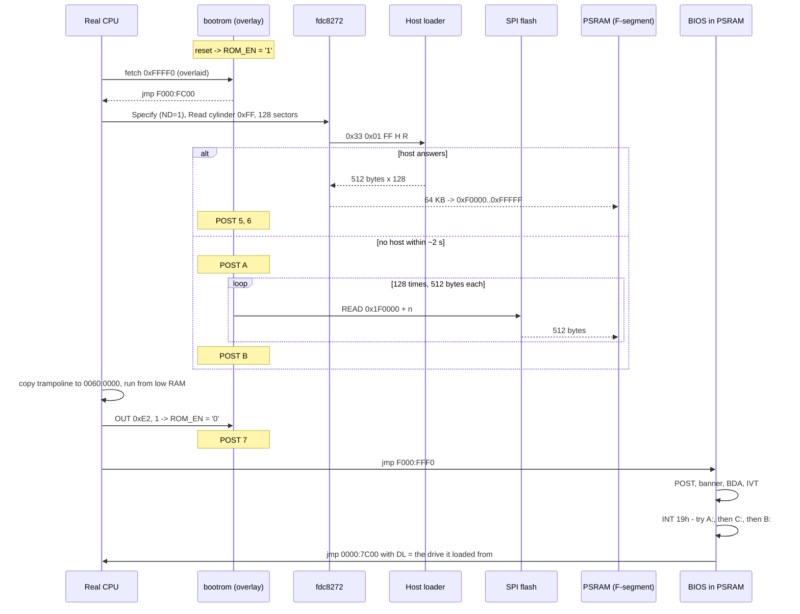

# Boot flow

From power-on to the DOS prompt. The interesting part is that the machine has **no
ROM**: the F-segment is PSRAM, so the BIOS has to be fetched from somewhere before
the CPU can run it.

## The whole sequence



> **The flash read is 512 bytes at a time, not one 64 KB burst.** It used to be one
> command, which is what the part allows — and about a sixth of the bytes came back
> wrong. See [gotchas](gotchas.md#a-long-spi-read-does-not-come-back-intact).

## 1. Reset

`ROM_EN` starts at `'1'`, so memory **reads** in `0xFFC00`–`0xFFFFF` return the 1 KB
boot ROM instead of PSRAM. Writes always pass through — that is what lets the loader
fill the BIOS image underneath itself.

The CPU fetches its reset vector from `0xFFFF0`, which is inside the overlay:

```asm
jmp 0xF000:0xFC00        ; the loader entry
```

## 2. The loader fetches a BIOS

Source: [`tools/bootldr_64k.asm`](../tools/bootldr_64k.asm), documented in
[`bootrom`](modules/bootrom.md).

It puts its stack at `0x7C00` in low M9K RAM, then tries **serial first**:

- `Specify` with `ND = 1` — non-DMA, so no 8237 programming is needed
- `Read Data` for **cylinder `0xFF`**, 128 sectors of 512 bytes = 64 KB
- Bytes are read from the `0x3F5` FIFO and `stosb`'d into `0xF0000`–`0xFFFFF`

Cylinder `0xFF` is not a real cylinder. The host loader recognises it as "send me the
BIOS image" and serves bytes from the BIOS file at offset `(R - 1) × 512`.

Serial is tried first on purpose: while a host is connected, BIOS development stays a
rebuild-and-reboot away.

### Fallback to flash

The **first** byte is read with a bounded wait of roughly two seconds. If no host
answers, the loader instead reads 64 KB from SPI flash at `0x1F0000` using the
[`flash`](modules/flash.md) byte engine, and checks the result before trusting it:

```asm
cmp byte [es:0xFFF0], 0xEA   ; a reset vector must start with a far jump
jne .nobios                  ; -> POST EF and halt
```

A blank chip reads `0xFF` everywhere, which would otherwise "boot" into erased flash.

> **Status: the serial path is the working one.** The flash path reaches POST `B` and
> loads an image, but the result renders as corrupted text and then stalls, even though
> `BIOSFLSH` verifies the flash contents byte-for-byte against the running BIOS. The
> cause is believed to be in the boot ROM's SPI read timing and is still open. The
> fallback is inert whenever a host answers, so it does not affect normal use.

## 3. Hand-off

Disabling the overlay pulls the ground out from under the code that is executing, so
the loader copies a tiny trampoline to `0x0060:0x0000` and jumps to it. Low RAM is
never overlaid:

```asm
trampoline:
        mov  dx, 0xE2
        mov  al, 1
        out  dx, al            ; ROM_EN <- 0; 0xFFFF0 is PSRAM now
        jmp  0xF000:0xFFF0     ; the loaded BIOS reset vector
```

## 4. BIOS POST

See [BIOS](bios.md) for detail. In order:

1. `CLI`, `CLD`, `DS = 0xF000`, stack at `0x7C00`
2. **Video first** — `vid_init` programs the 6845 and CGA registers, then the banner is
   drawn straight to `0xB8000` with interrupts still off, so something appears even if
   the interrupt controller or timer is misbehaving
3. 8259 PIC, 8253 PIT (18.2 Hz tick), 8255 PPI
4. BIOS data area: equipment word, memory size, keyboard buffer pointers, video state,
   floppy geometry defaults
5. Interrupt vector table — all 256 entries to a dummy `iret`, then the real handlers
6. `hd_detect` — read the SPI flash JEDEC ID and print the fixed-disk line
7. `INT 19h`

## 5. INT 19h — bootstrap

The boot order is a table, so it is data rather than control flow:

```asm
boot_order: .byte 0x00, 0x80, 0x01, 0xFF   # A:, C:, B:, end
```

For each entry in turn:

```asm
reset drive (AH=00)
read C0 H0 S1 -> 0000:7C00        ; 1 sector
check for 0xAA55 at 0x7DFE        ; not bootable -> next entry
capture BPB geometry              ; floppies only, into BDA 0xB0..0xB2
mov dl, <this drive>
jmp 0000:7C00
```

Two entries can be skipped before they are tried: **`A:`** if POST found nothing
serving it (BDA `40:B7`), and **`C:`** unless POST advertised a fixed disk in BDA
`40:75`. Skipping `A:` matters because otherwise every boot with the loader muted pays
the FDC timeout a second time.

The BPB capture is **floppies only**: a fixed disk's first sector is a partition table,
not a BPB, so reading `spt` and `heads` out of it would be reading partition entries.
It makes `INT 13h AH=08` report the geometry of the *actual* image being served rather
than a hardcoded guess.

Running out of entries prints what the original ROM printed — `Boot Error.` then
`Press Ctrl-Alt-Del to Reboot ... `. The full order and its reasoning is in
[storage](storage.md#boot-order).

Interrupts stay off through the boot read, because the disk path is polled.

## POST codes

Shown on the [7-segment display](modules/sevenseg.md) at I/O `0x80`. The last value
displayed is where it stopped.

| Code | Meaning |
|---|---|
| `1` | loader entered, stack set |
| `2` | about to talk to the FDC |
| `3` | `Specify` accepted |
| `4` | `Read Data` issued for cylinder `0xFF` |
| `5` | first data byte received from the host |
| `6` | all 64 KB received |
| `7` | about to disable the overlay and jump to the BIOS |
| `A` | no serial host — falling back to flash |
| `B` | 64 KB read from flash |
| `EF` | flash holds no BIOS image — halted |

Stuck on `4` means the host never answered *and* the timeout did not fire. `EF` means
the fallback ran but the flash copy is missing or wrong.

> A **steady** code does not distinguish "halted here" from "looping here" — the
> display only restarts its cycle when the value *changes*. See
> [sevenseg](modules/sevenseg.md).

## Untethering the board

**Done — the board runs standalone.** Three things were tethered at power-on, and none
of them are any more:

| What | How to untether |
|---|---|
| **FPGA configuration** | `bash tools/mkjic.sh`, then program the `.jic` to the DE0-Nano's EPCS16 |
| **BIOS image** | `BIOSFLSH` writes a copy to the reserved top of the flash; the loader falls back to it when no host answers |
| **The operating system** | DOS on the [USB hard disk](storage.md#drive-c--usb-mass-storage), which `INT 19h` tries before `B:` |

A serial host is now a *development* convenience — it wins over the flash copy when
present, so a rebuilt BIOS is a reboot away — rather than a requirement. Drive `A:`
reports NOT READY without one, and the boot moves on.

## Related

- [bootrom](modules/bootrom.md) — the overlay and the loader
- [fdc8272](modules/fdc8272.md) — cylinder `0xFF` and the host protocol
- [BIOS](bios.md) — what runs after the hand-off
- [Building](building.md) — `mkjic.sh` and programming
- [Storage](storage.md) — the three drives and the boot order
- [Status and roadmap](status.md) — what is verified working
